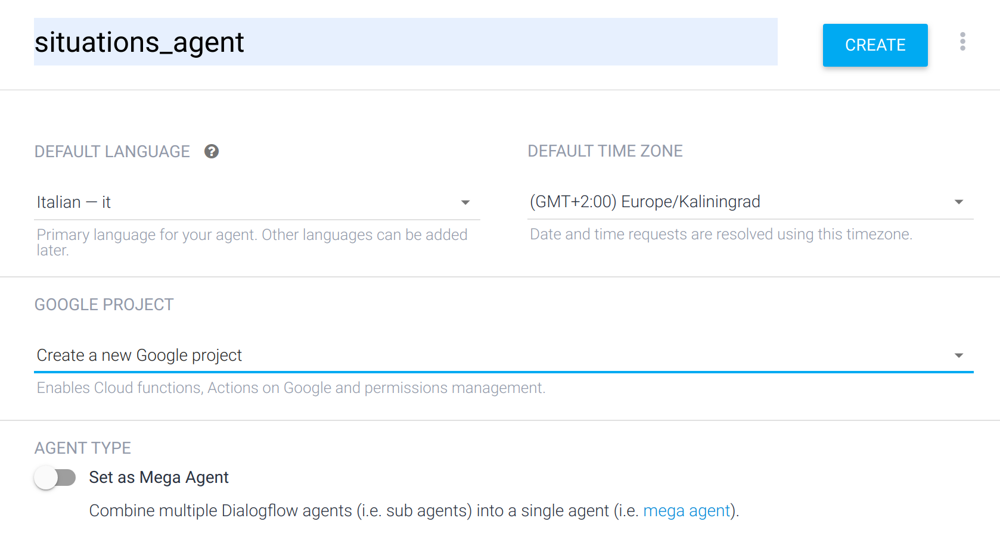
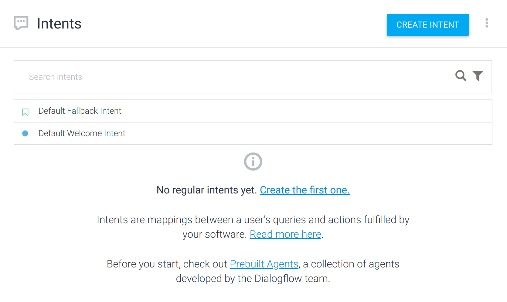
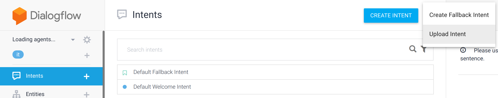
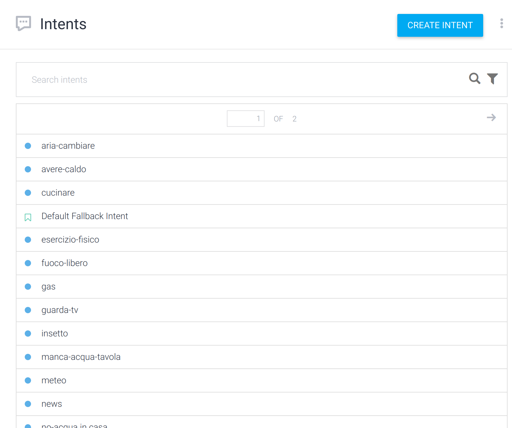

## Getting started

### Setting up DialogFlow

Follow the guide at https://cloud.google.com/dialogflow/docs/quick/setup
(available also in the file `dialogflow_quickstart.html`) in order to
set up the connection between the Python client and DialogFlow.
Briefly:

1. Start creating a new DialogFlow agent and the related Google project:



Now, you should have an empty agent with the only `Default` intent:



2. Go to tour [Google Cloud Platform](https://console.cloud.google.com/)
   console. You should find the related project:


3. Following the instructions in
   https://cloud.google.com/dialogflow/docs/quick/setup, create a Service
   Account fitting the Dialogflow Agent and download the JSON key.

4. The JSON key shoud be saved in the root folder of this project
   (the same as this README and the `client.py` file) and
   called `google_key.json`. It shoud present the following fields:

```json
{
  "type": "service_account",
  "project_id": ,
  "private_key_id": ,
  "private_key": ,
  "client_email": ,
  "client_id": ,
  "auth_uri": ,
  "token_uri": ,
  "auth_provider_x509_cert_url": ,
  "client_x509_cert_url":
}
```

5. Install and configure then your Google Cloud SDK
   (see https://cloud.google.com/sdk/docs).

### The `settings.json` file

(...)

### Prepare the dataset

A dataset of Italian sentences linked to 21 situations (85 sentences for
each situations) is available at `situations_dataset_.csv`. In
order to train the DialogFlow agent, you have to:

1. Convert the CSV data into JSON data by running:

```linux
python dataset/csv_to_json.py
```

2. Upload the 21 `.json` files created to DialogFlow:



3. At the end, you should have a situation like the one here in the picture:



### Run a demo

To simply test the agent you can run the `agent.py` file as follows:

```linux
python agent.py -s "Ho davvero caldo"
```

The result would be something like 
`"Ho davvero caldo" -> Intent: avere-caldo (score: 0.8965118527412415)`.
This means the DialogFlow agent identified the intent `avere-caldo`
from the sentence "Ho davvero caldo" with a confidence of almost 90%.
